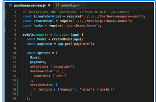
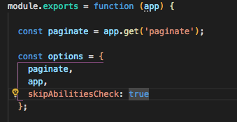

# Authouriztion

**All the  services in the app are private by default.**

with rules you can manage how can access the services.

## Rule structure

Each rule is an object

```javascript
{
    "name": string,
    "description": string,
    "actions": array,
    "subject": array,
    "roles": array,
    "fields" : array,
    "conditions": object when hardcoded \ stringify on DB,
    "userContext" :  object when hardcoded \ stringify on DB,
    "populateWhitelist" : array,
    "anonymousUser" : bollean,
    "active" : bollean,
    "from" : date,
    "to": date
}
```

## You can define rules in 3 places:

    **1.Service options**  
       Add serviceRules to options



        **skipAbilitiesCheck**  
        Inside service.options you can set the skipAbilitiesCheck = true.      
        and handle the Authorization by your self



**2.Config file**  
        Add rules to defaultRules at the config.feathers-mongoose-casl   


    **3. DB rules collection**

```javascript
curl -X POST \
  http://localhost:3030/rules \
  -H 'Content-Type: application/json' \
  -H 'Postman-Token: 0d67b647-49b1-4ce4-baed-cbc109d043b1' \
  -H 'cache-control: no-cache' \
  -d '{
  "name": "allowAll",
  "actions": ["mangae"],
  "subject": ["all"],
  "active": true
}'
```

## Service default rules

By default any service have get 5 rules

* **create-&lt;serviceName&gt;**
* **read-&lt;serviceName&gt;**
* **update-&lt;serviceName&gt;**
* **delete-&lt;serviceName&gt;**
* **manage-&lt;serviceName&gt;**

If you want to allow a specific user to delete posts then add  **delete-posts**  
to user.roles

## Each rule define by this fields:

* **name** - string the name of the rule. 
* **description** - string optional, add info about the rule  
* **actions** - array  
  required, **define the methods to allow**

  * _manage_ - allow all actions
  * create
  * read
  * _update_
  * _remove_

  example \['posts' ,'users'\]  

* _**subject**_ - array   
  required, **define the services to allow**

  example \['posts' ,'users'\]  

* _**conditions**_ - object when hardcoded \ stringify on DB,  
  Allow specific user by user context

  examples:

  * "conditions":  { "\_id": "{{ user.\_id }}" } let the user to \[actions\] only if doc id equal to user id
  * "conditions": { "author": "{{ user.\_id }}" } let user to \[actions\] only if author equal to is \_id
  * "conditions":  { "active": true } let the user \[actions\] only when active is true

  we use [nunjucks](https://mozilla.github.io/nunjucks/) to handle the templates, to convert {{ user.\_id}}  to a user id \(we get the user id from jwt\)

  you can build conditions like a mongoose query with MongoDB operators: [$in](https://www.npmjs.com/package/sift#in), [$nin](https://www.npmjs.com/package/sift#nin), [$exists](https://www.npmjs.com/package/sift#exists)....

  * see this[ feathers-mongoose](https://github.com/feathersjs-ecosystem/feathers-mongoose#serviceoptions) docs, some of operators need to expose with whitelist\[\] inside the options 

* **userContext** -  object when hardcoded \ stringify on DB  
  Define the users that the rule are relevant for them by the user document context

  examples:

  * {"email":{"$eq":"doron+1@committed.co.il"}}
  * {"writer":{"$eq": true}}
  * 
  

* **anonymousUser -** boolean Set true if the rules relevant to anonymous user 
* **roles -** array  
  Define the users that the rule are relevant for them by the user roles

  example - \["writer"\]  

* **fields** - array   
  Define specific fields the the rule allow or not allow.

  * **Simple**
    * **Allow specific fields** before find/get we add this fields to [feathers select](https://docs.feathersjs.com/api/databases/querying#select)  example - \['title', 'body'\]
    * **Block specific fields** example - \['-price'\] before create/update/patch we add this fields to [feathers select](https://docs.feathersjs.com/api/databases/querying#select)
  * **Complex**
    * **Allow/block field with condition** examples: **1.** expose the author object  only when the user is the author, all the else user can see the email field in the author object ****\["\*",  {    "path": "author",     "when": {"author.\_id" : "{{ user.\_id}}"} ,     "then" : \["\*"\] ,      "otherwise": \["email"\]  } \] **2.** expose only email from author object \["\*", {"path": "author", "select": \["email", "-updatedAt"\] }\] **3**. expose only email from each item inside authors array \["\*", {"path": "authors", "select": \["email", "-updatedAt"\], type: 'array' }\]

  \*\*\*\*

  * we support deep field \['user.name'\]
  * we also support a deep field in  array values
  * we use [nunjucks](https://mozilla.github.io/nunjucks/) to handle the templates and convert {{ user.\_id}}  to user id \(we get the user id from jwt\) 

* **populateWhitelist** - array Define the collections that you allow to populates. when a user requests to populate something that not in the list, we remove it before we call to DB, to use populate you need to enabled this in the [service options](https://github.com/feathersjs-ecosystem/feathers-mongoose#serviceoptions) read more [https://feathersjs-mongoose.gitbook.io/feathers-mongoose-casl/guides/populate](https://feathersjs-mongoose.gitbook.io/feathers-mongoose-casl/guides/populate) 
* **active** - boolean - relevant only to DB rule Set true to enabled the rule. 
* **from** - date optional - enabled the rule from specific date 
* **to** - date optional - enabled the rule until specific date

## schema

rules JOI schema

```javascript
    name: Joi.string(),
    description: Joi.string(),
    actions: Joi.array().items(Joi.string().valid('create', 'read', 'update', 'delete', 'manage'))[required](),
    subject: Joi.array().items(Joi.string())[required](),
    fields: Joi.array(),
    populateWhitelist: Joi.array(),
    active: Joi.boolean().meta({ dashboard: { initialValue: true } }),
    from: Joi.date(),
    to: Joi.date(),
    conditions: Joi.string().stringify(),
    anonymousUser: Joi.boolean().meta({dashboard: { initialValue: false }}),
    userContext: Joi.string().stringify(),
    roles: Joi.array(),
```

## Example of rules:

```javascript
      {
        "description": "allow all to read posts",
        "actions": ["read"],
        "subject": ["posts"],
        "anonymousUser": true
      },
      {
        "description": "allow only logged in users to read posts",
        "actions": ["read"],
        "subject": ["posts"]
      },
      {
        "description": "allow only logged in users to read posts, and allow to populate the author",
        "actions": ["read"],
        "subject": ["posts"],
        "populateWhitelist": ["author"]
      },
      {
        "description": "allow only logged in users to read posts, and allow to populate the author, allow only author.email inside author data",
        "actions": ["read"],
        "subject": ["posts"],
        "fields": ["*", {"path": "author", "select": ["email", "-updatedAt"] }],
        "populateWhitelist": ["author"]
      },
      {
        "description": "allow only logged in users to read posts, and get only the title from the comments array",
        "actions": ["read"],
        "subject": ["posts"],
        "fields": ["*", {"path": "comments", "select": ["title"], "type": "array" }],
        "populateWhitelist": ["author"]
      },
      {
        "description": "allow only logged in users to read posts, and allow to populate the author, allow only author.email if user is not the author",
        "actions": ["read"],
        "subject": ["posts"],
        "fields": ["*", {"path": "author", "when": {"author._id" : "{{ user._id}}"} , "then" : ["*"] , "otherwise": ["email"]  }],
        "populateWhitelist": ["author"]
      },
      {
        "description": "allow only writer to read posts",
        "actions": ["read"],
        "subject": ["posts"],
        "roles": ["writer"]
      },
      {
        "description": "allow only user with specific email",
        "actions": ["read"],
        "subject": ["posts"],
        "userContext": {"email":{"$eq":"doron+1@committed.co.il"}}
      },
      {
        "description": "allow user to update is age and address",
        "actions": ["update"],
        "subject": ["users"],
        "fields:": ["age", "address"],
        "conditions": {"_id": "{{ user._id }}"}
      }
```

### When user make request to one service and from this service you make another request to other service, you need to persist user and provider to get response from the other service base is user abilities, read this:



###  

